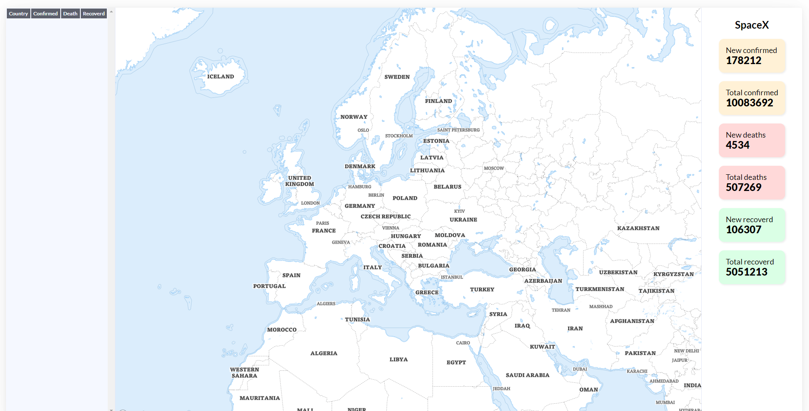

## Uitleg
Wat je te zien krijgt op de pagina is een dashboard van spaceX, met de map is snel te zien op welke posities er zijn op de wereld en met de info die er bij staat kan je zien hoeveel doden etc er zijn die iets te maken hebben met spaceX. Het is een overzicht met alle gebeurtenissen qua mensen in het spaceX plan

## API Connections
Er zijn twee verschillende apis gebruikt. Eentje is om de map in te laden deze komt van de website ...... af en de andere is om de doden van corona uit te lezen deze komen van ..... af. 

## Schetsen
Ik ben begonnen met schetsen en het opdoen van info / ideeën hieronder is dat te vinden. Vervolgens is dit uitgewerkt.

## Website live
De website is live te bekijken via de volgende link: https://dinohier.github.io/API-Dashboard1/



## Download uitleg
Als de website gedownload wordt en lokaal bekeken wil worden moet, deze NPM (Node) instaleren anders werkt deze website lokaal niet. Ook kan je een online omgeveging creeren net zoals XAMP of een Live omgeving met bepaalde code editors zodat de website werkt zonder node te instaleren.

Run project

Met npm
```bash
npm install && npm run serve
```

Met yarn
```bash
yarn install && yarn serve
```
